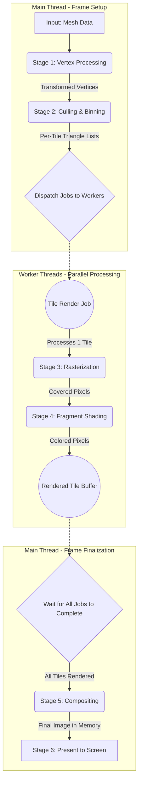
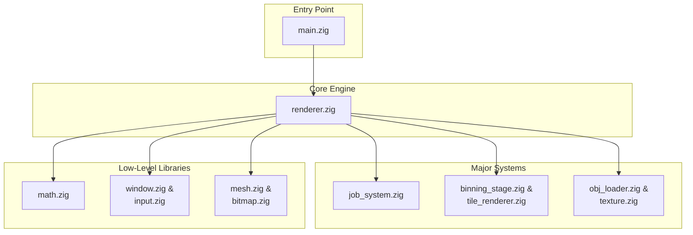

# Zig 3D CPU Rasterizer

A high-performance, CPU-based 3D rasterizer built from scratch in Zig. This project showcases advanced rendering techniques, including a multi-threaded, tile-based pipeline, real-time lighting, texture mapping, and interactive controls. It serves as a comprehensive example of systems programming in Zig for graphics applications.

## Key Features

*   **Advanced Rendering Pipeline**: A complete 3D rendering pipeline, from model loading to final image composition.
*   **Multi-threaded Rendering**: Utilizes a custom-built, work-stealing job system to parallelize the rendering workload across multiple CPU cores, significantly boosting performance.
*   **Tile-Based Architecture**: The screen is divided into a grid of tiles that are rendered independently. This approach improves cache locality and is the foundation for the parallel rendering system.
*   **Real-time Lighting and Shading**: Implements a flat shading model with a dynamic, directional light source that can be manipulated interactively.
*   **Texture Mapping**: Supports textured models, with correct perspective-aware texture coordinate interpolation.
*   **Model Loading**: Loads 3D models from the Wavefront `.obj` file format.
*   **Interactive Controls**: Full real-time control over the camera and light source position.
*   **Debug Visualizations**: Includes optional overlays for wireframe rendering and tile boundaries to help visualize the rendering process.

## The Rendering Pipeline

The renderer processes 3D scenes through a sophisticated, multi-stage pipeline designed for performance and parallelism.

1.  **Vertex Transformation**: 3D model vertices are transformed from model space into world space and then into camera space using matrix transformations.
2.  **Perspective Projection**: The 3D camera-space coordinates are projected into 2D screen-space coordinates, creating the illusion of depth.
3.  **Backface Culling**: Triangles that are facing away from the camera are culled early in the pipeline to avoid unnecessary processing.
4.  **Triangle Binning**: Each triangle is assigned to one or more screen-space tiles that it overlaps. This "binning" process creates a list of triangles for each tile to render.
5.  **Parallel Tile Rendering**: The core of the rendering process. The job system dispatches rendering jobs for each tile to a pool of worker threads. Each thread independently rasterizes, shades, and textures the triangles in its assigned tiles.
6.  **Rasterization**: For each triangle, the scanline algorithm is used to determine which pixels to fill.
7.  **Shading and Texturing**: The color of each pixel is calculated based on the lighting conditions and the model's texture.
8.  **Compositing**: Once all tiles are rendered, they are composited together into the final framebuffer, which is then displayed on the screen.

## Architecture

The project is designed with a modular architecture, where each component has a single, well-defined responsibility.

*   **`main.zig`**: The application's entry point. It initializes the window, renderer, and job system, and runs the main event loop.
*   **`renderer.zig`**: The central orchestrator of the rendering process. It manages the rendering pipeline, handles user input, and coordinates the other rendering-related modules.
*   **`job_system.zig`**: A general-purpose, work-stealing job system that enables parallel execution of tasks. It is used to parallelize the tile rendering stage.
*   **`tile_renderer.zig`**: Contains the logic for tile-based rendering, including the data structures for tiles and tile grids.
*   **`binning_stage.zig`**: Implements the triangle binning logic, which is a crucial step in the tile-based rendering pipeline.
*   **`mesh.zig` & `obj_loader.zig`**: Handle the data structures for 3D models and the logic for loading them from `.obj` files.
*   **`texture.zig` & `bitmap.zig`**: Manage texture and image data, including loading and sampling.
*   **`math.zig`**: A comprehensive 3D math library with support for vectors, matrices, and transformations.
*   **`window.zig`**: Abstracts the platform-specific window creation and management logic.

## Rendering Pipeline Diagram

## Architecture Diagram

## Controls

*   **Arrow Keys**: Rotate the model.
*   **WASD Keys**: Orbit the light source around the model.
*   **Q/E Keys**: Adjust the camera's field of view (FOV).

## Future Goals

While the rasterizer is fully functional, there are many opportunities for further development and learning:

*   **Advanced Shading Models**: Implement more sophisticated shading techniques like Gouraud or Phong shading for smoother, more realistic lighting.
*   **More Complex Scenes**: Extend the renderer to support multiple objects and a more complex scene graph.
*   **Performance Optimizations**: Further optimize the rendering pipeline, for example by implementing more advanced culling techniques like frustum culling.
*   **Cross-Platform Support**: Port the windowing and input handling logic to other operating systems like Linux and macOS.

## License

This project is open source and available under the MIT License.