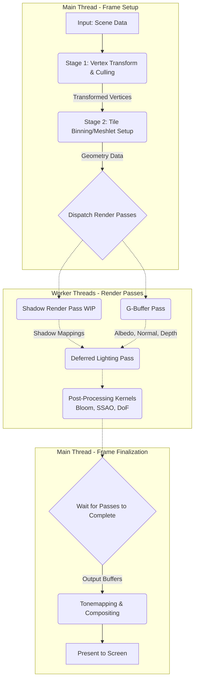
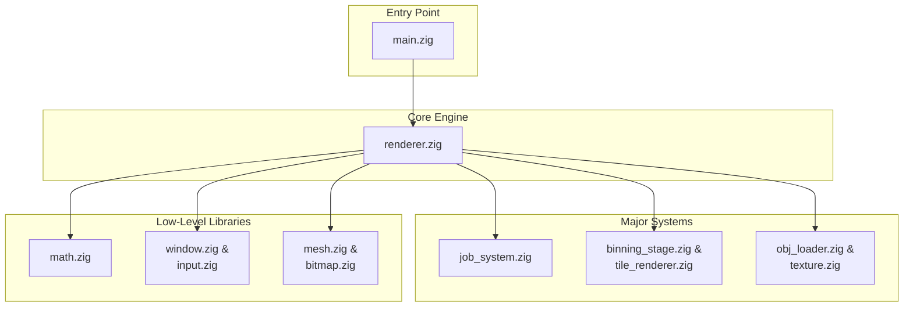

# Zig 3D CPU Rasterizer

A high-performance, CPU-based 3D rasterizer built from scratch in Zig. This project showcases advanced rendering techniques, including a multi-threaded, tile-based pipeline, real-time lighting, texture mapping, and interactive controls. It serves as a comprehensive example of systems programming in Zig for graphics applications.

## Key Features

*   **Advanced Rendering Pipeline**: A complete 3D rendering pipeline, from model loading to final image composition, including a deferred rendering path.
*   **Multi-threaded Rendering**: Utilizes a custom-built, work-stealing job system to parallelize the rendering workload across multiple CPU cores, significantly boosting performance.
*   **Tile-Based Architecture**: The screen is divided into a grid of tiles that are rendered independently, improving cache locality. Future iterations plan to transition to a meshlet-based compute approach.
*   **Render Passes (In Progress)**: The pipeline represents a modern deferred shading architecture featuring multiple full-screen and compute kernels:
    *   **G-Buffer Pass**: Captures albedo, normals, and depth.
    *   **Deferred Lighting**: Computes complex lighting based on G-Buffer data.
    *   **Post-Processing**: Includes kernels for Bloom, Screen Space Ambient Occlusion (SSAO), Depth of Field (DoF), and Tonemapping.
    *   **Shadow Render Pass (WIP)**: Currently implementing a dedicated shadow mapping pass to generate dynamic shadows based on directional and point light sources.
*   **Real-time Lighting and Shading**: Implements dynamic light sources that can be manipulated interactively.
*   **Texture Mapping**: Supports textured models, with correct perspective-aware texture coordinate interpolation.
*   **Model Loading**: Loads 3D models from the Wavefront `.obj` file format and handles complex mesh structures.
*   **Interactive Controls**: Full real-time control over the camera and light source position.
*   **Debug Visualizations**: Includes optional overlays for wireframe rendering, tile boundaries, and depth/normal visualizations to help debug the rendering process.

## The Rendering Pipeline

The renderer processes 3D scenes through a sophisticated, multi-stage pipeline designed for performance and parallelism.

1.  **Vertex Transformation**: 3D model vertices are transformed from model space into world space and then into camera space using matrix transformations.
2.  **Perspective Projection**: The 3D camera-space coordinates are projected into 2D screen-space coordinates, creating the illusion of depth.
3.  **Backface Culling**: Triangles that are facing away from the camera are culled early in the pipeline to avoid unnecessary processing.
4.  **Triangle Binning**: Each triangle is assigned to one or more screen-space tiles that it overlaps. This "binning" process creates a list of triangles for each tile to render.
5.  **Parallel Tile Rendering**: The core of the rendering process. The job system dispatches rendering jobs for each tile to a pool of worker threads. Each thread independently rasterizes, shades, and textures the triangles in its assigned tiles.
6.  **Rasterization**: For each triangle, the scanline algorithm is used to determine which pixels to fill.
7.  **Shading and Texturing**: The color of each pixel is calculated based on the lighting conditions and the model's texture.
8.  **Compositing**: Once all tiles are rendered, they are composited together into the final framebuffer, which is then displayed on the screen.

## Architecture

The project is designed with a modular architecture, where each component has a single, well-defined responsibility.

*   **`main.zig`**: The application's entry point. It initializes the window, renderer, and job system, and runs the main event loop.
*   **`renderer.zig`**: The central orchestrator of the rendering process. It manages the rendering pipeline, handles user input, and coordinates the other rendering-related modules.
*   **`job_system.zig`**: A general-purpose, work-stealing job system that enables parallel execution of tasks. It is used to parallelize the tile rendering stage.
*   **`tile_renderer.zig`**: Contains the logic for tile-based rendering, including the data structures for tiles and tile grids.
*   **`binning_stage.zig`**: Implements the triangle binning logic, which is a crucial step in the tile-based rendering pipeline.
*   **`mesh.zig` & `obj_loader.zig`**: Handle the data structures for 3D models and the logic for loading them from `.obj` files.
*   **`texture.zig` & `bitmap.zig`**: Manage texture and image data, including loading and sampling.
*   **`math.zig`**: A comprehensive 3D math library with support for vectors, matrices, and transformations.
*   **`window.zig`**: Abstracts the platform-specific window creation and management logic.

## Rendering Pipeline Diagram

```mermaid
flowchart TD
    subgraph "Main Thread - Frame Setup"
        direction LR
        A[Input: Scene Data] --> B(Stage 1: Vertex Transform & Culling);
        B -- Transformed Vertices --> C(Stage 2: Tile Binning/Meshlet Setup);
        C -- Geometry Data --> D{Dispatch Render Passes};
    end

    subgraph "Worker Threads - Render Passes"
        direction TB
        D -.-> SP(Shadow Render Pass WIP)
        D -.-> GB(G-Buffer Pass)
        
        SP -.-> |Shadow Mappings| DL
        GB -.-> |Albedo, Normal, Depth| DL(Deferred Lighting Pass)
        
        DL -.-> PP(Post-Processing Kernels<br>Bloom, SSAO, DoF)
    end

    subgraph "Main Thread - Frame Finalization"
        direction LR
        I{Wait for Passes to Complete};
        PP -.-> I;
        I -- Output Buffers --> J(Tonemapping & Compositing);
        J --> K[Present to Screen];
    end
```

## Architecture Diagram

```mermaid
graph TD
    subgraph "Entry Point"
        main["main.zig"];
    end

    subgraph "Core Engine"
        renderer["renderer.zig"];
    end

    subgraph "Major Systems"
        job_system["job_system.zig"];
        pipeline["binning_stage.zig &<br>tile_renderer.zig"];
        assets["obj_loader.zig &<br>texture.zig"];
    end

    subgraph "Low-Level Libraries"
        math["math.zig"];
        platform["window.zig &<br>input.zig"];
        data["mesh.zig &<br>bitmap.zig"];
    end

    main --> renderer;
    
    renderer --> job_system;
    renderer --> pipeline;
    renderer --> assets;
    
    renderer --> math;
    renderer --> platform;
    renderer --> data;
```

## Controls

*   **Arrow Keys**: Rotate the model.
*   **WASD Keys**: Orbit the light source around the model.
*   **Q/E Keys**: Adjust the camera's field of view (FOV).

## Future Goals

While the rasterizer is fully functional and features many advanced rendering techniques, there are ongoing areas of development:

*   **Shadow Render Pass**: Completing the in-progress dynamic shadow pass (shadow mapping) for full integration into the deferred lighting pipeline.
*   **Meshlet Compute Pipeline**: Transitioning fully to a GPU-style, compute-based meshlet rendering architecture, replacing or supplementing the tile-based rasterizer.
*   **Advanced Shading Models**: Implement physically based rendering (PBR) shading models for more realistic lighting and material interaction.
*   **Performance Optimizations**: Further optimize the rendering pipeline using SIMD-accelerated math kernels, and advanced culling techniques (i.e., frustum/occlusion culling on meshlets).
*   **Cross-Platform Support**: Port the windowing and input handling logic to other OS targets beyond Windows.

## License

This project is open source and available under the MIT License.