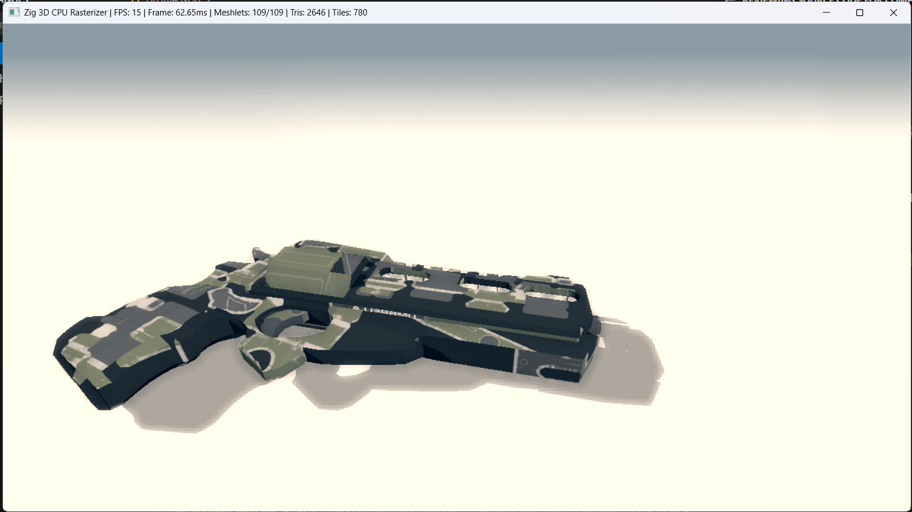
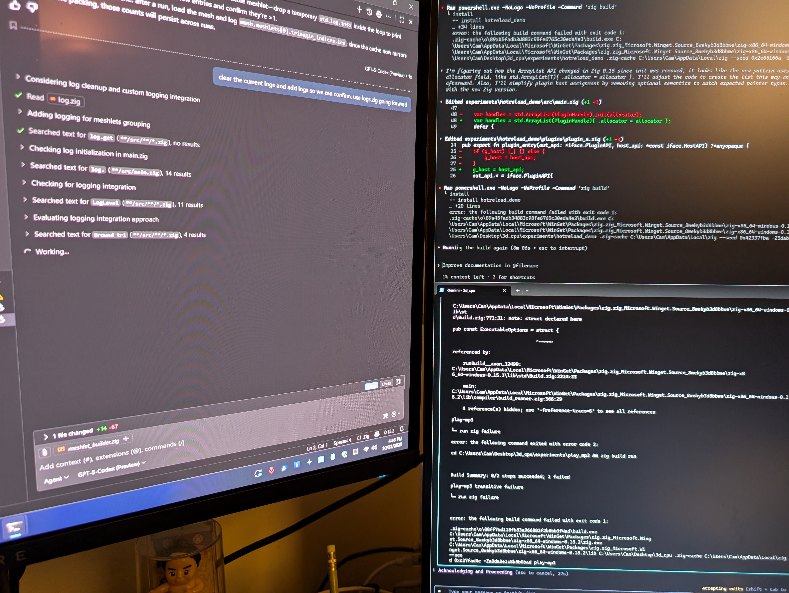

# learn_zig_and_3d

A Windows-native 3D renderer written in Zig, built around CPU rasterization, tile-based work distribution, meshlet experiments, runtime SIMD dispatch, and a small rigid-body scene driven by zphysics.





## Overview

This repository is a hands-on graphics playground. It mixes engine work, rendering experiments, profiling tools, and asset-loading code in one place so you can iterate quickly on rendering ideas without hiding the low-level details.

The current app is a Win32 desktop executable that:

- loads a GLB revolver scene, with an OBJ fallback path
- renders through a CPU-driven pipeline with tiled work scheduling
- supports post-processing and shadow-system experiments
- uses runtime CPU feature detection for scalar, SSE2, AVX2, and newer paths where implemented
- simulates the on-screen model as a physics body through zphysics/Jolt

## Quick Start

Requirements:

- Windows
- Zig 0.15.x

Common commands:

```powershell
zig build run
zig build run -Doptimize=ReleaseFast
zig build check
zig build validate
zig build benchmarks
zig build hotreload-demo
```

`zig build validate` covers the renderer, benchmarks, and the hot reload experiment.

For direct binary launches after a build:

```powershell
.\zig-out\bin\zig-windows-app.exe
```

## Highlights

- CPU-first renderer written from scratch in Zig
- custom job system for parallel frame work
- tile-based rendering path with meshlet-oriented experiments
- runtime SIMD backend selection
- directional lighting, HDRI support, textures, and post-processing passes
- profiling support for exact frame-pass timings and stack sampling
- small experiments folder for focused renderer-side prototypes

## Render Pass Architecture

This is the same pipeline from `engine/src/renderer.zig`, but grouped so the frame flow is easier to scan.


```mermaid
flowchart LR
	A[Frame start] --> B[Update camera and frame view]
	B --> C[mesh_work_update]
	C --> D{Shadow maps}
	D -->|on| E[buildShadowMap per light]
	D -->|off| F{Scene path}
	E --> F

	F -->|tiled| G[renderTiled<br/>meshlet_tiled + meshlet_shadows]
	F -->|direct| H[renderDirect<br/>meshlet_direct]
	G --> I[Post dispatcher]
	H --> I

	subgraph P[Optional post stack]
		direction LR
		P1[skybox]
		P2[shadow resolve + hybrid shadow]
		P3[ssao + ssgi + ssr + depth fog]
		P4[taa + motion blur]
		P5[god rays + bloom + lens flare + dof]
		P6[chromatic aberration + film grain vignette + color grade]
		P1 --> P2 --> P3 --> P4 --> P5 --> P6
	end

	I --> P1
	P6 --> Q[Light markers and present]
```

## Current Controls

These controls reflect the current code, not an older design:

- `W`, `A`, `S`, `D`: move the camera on the horizontal plane
- `Space`: move the camera up
- `Ctrl`: move the camera down
- Arrow keys: rotate camera yaw and pitch
- Mouse movement: look around
- `Q` / `E`: adjust field of view
- `P`: toggle the render overlay
- `H`: toggle hybrid-shadow debug stepping
- `N`: advance one hybrid-shadow debug step when debug stepping is enabled
- `Enter`: trigger the physics-driven jump on the on-screen model
- `Esc`: quit

## Build And Run

The root build script is the main entry point for the renderer and convenience steps for related subprojects.

Main commands:

```powershell
zig build run
zig build -Doptimize=ReleaseFast
zig build check
zig build validate
zig build benchmarks
zig build run-benchmarks
zig build hotreload-demo
```

Useful build flags:

- `-Doptimize=Debug`: easier debugging
- `-Doptimize=ReleaseFast`: best default for runtime testing
- `-Dprofile=true`: keeps frame pointers for native sampling tools
- `-Dcpu=...`: force a target CPU level when you intentionally want a narrower binary target

Examples:

```powershell
zig build -Doptimize=ReleaseFast -Dprofile=true
zig build -Dcpu=x86_64_v4 -Doptimize=ReleaseFast
```

## Profiling

The project already includes two useful profiling paths:

- exact per-pass frame timing from the renderer
- native call-stack sampling through `tools/native-stack-sampler.py`

Quick examples:

```powershell
$env:ZIG_RENDER_PROFILE_FRAME = '120'
zig build -Doptimize=ReleaseFast -Dprofile=true
.\zig-out\bin\zig-windows-app.exe
```

```powershell
python tools\native-stack-sampler.py --launch zig-out\bin\zig-windows-app.exe 12 1
```

Useful runtime environment variables:

- `ZIG_RENDER_PROFILE_FRAME`: dump exact timings for one frame
- `ZIG_RENDER_TTL_SECONDS`: auto-exit after a short smoke-test run

For the full workflow, see `docs/performance-profiling.md`.

## Project Layout

- `app/src/`: executable entrypoint
- `engine/src/`: main renderer, platform code, physics hookup, kernels, and core systems
- `assets/`: models, textures, HDRI assets, and runtime config
- `docs/`: architecture, profiling notes, specs, and project planning
- `benchmarks/`: focused math and rendering microbenchmarks
- `experiments/`: isolated feature spikes such as hot reload workflows
- `tools/`: profiling helpers and utility scripts

Repository map:

```text
.
|- build.zig              # root build entry point
|- build.zig.zon          # external dependency manifest
|- app/src/               # executable entrypoint
|- engine/src/            # engine and renderer code
|- assets/                # runtime assets and settings
|- docs/                  # design notes, specs, and profiling guides
|- benchmarks/            # standalone benchmark suite
|- experiments/           # isolated prototype projects
`- tools/                 # scripts used during development and profiling
```

Additional folder guides:

- `docs/README.md`
- `benchmarks/README.md`
- `experiments/README.md`
- `tools/README.md`
- `CONTRIBUTING.md`

## Notable Engine Pieces

- `app/src/main.zig`: executable entrypoint forwarding to engine runtime
- `engine/src/main.zig`: app bootstrap, message loop, physics step, and scene wiring
- `engine/src/renderer.zig`: camera, frame orchestration, tiled rendering, lighting, and post-processing control
- `engine/src/job_system.zig`: worker-thread scheduling
- `engine/src/shadow_system.zig`: shadow acceleration and reuse logic
- `engine/src/tile_renderer.zig`: tile-local raster and buffers
- `engine/src/meshlet_builder.zig` and related files: meshlet generation and caching work

## Status

This is an active learning-and-engineering repository, not a polished engine release. Expect experiments, profiling artifacts, feature spikes, and rapid iteration.

## Development Notes

- Core source now uses an `app/` + `engine/` split so runtime entrypoints and reusable systems evolve independently.
- Generated outputs, caches, and local profiling artifacts are expected to stay out of git.
- `assets/` is runtime content and `artifacts/` is local generated output (ignored by default).
- External dependency resolution currently relies on `build.zig.zon` for `zphysics`.

## License

This repository is licensed under MIT. See `LICENSE`.
