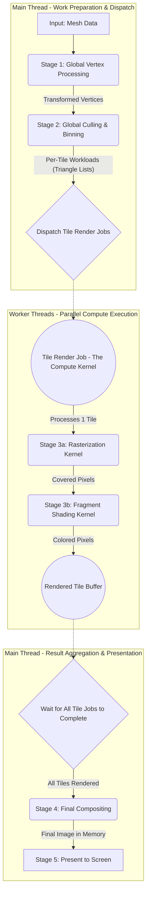

# The Rendering Pipeline: A CPU-Based Compute/Mesh Shader Approach

This document describes the step-by-step journey of a single triangle from a 3D model to the final image on the screen. Our renderer operates on a **CPU-based Compute/Mesh Shader paradigm**, leveraging a **Tiled, Multi-threaded architecture**.

The core idea is to treat the entire rendering process as a large compute job, broken down into many small, independent tasks (rendering a "tile") that can be executed in parallel by a job system. This approach plays to the strengths of the CPU as a general-purpose processor, rather than rigidly imitating a GPU's fixed-function pipeline.

## High-Level Diagram

---

## The Stages in Detail

### 1. Model Data Acquisition

*   **Where**: `src/mesh.zig`, `src/obj_loader.zig`
*   **Input**: An `.obj` file.
*   **Process**: The file is parsed to extract raw geometry data.
*   **Output**: A `Mesh` object containing lists of 3D vertices, texture coordinates, and normals. This is the initial data buffer for our compute pipeline.

### 2. Global Vertex Processing (The "Vertex Compute Pass")

*   **Where**: `src/renderer.zig` (in `render3DMeshWithPump`)
*   **Input**: The 3D position of every vertex from the `Mesh` object.
*   **Process**: Each vertex's 3D world-space position is transformed into 2D screen-space coordinates. This involves applying model, view, and projection matrices. This is a global compute pass that prepares all vertex data for subsequent stages.
*   **Output**: For each vertex, its final 2D position on the screen `(x, y)` and its depth `(z)` relative to the camera.

### 3. Global Culling & Workload Binning (The "Task Generation Pass")

*   **Where**: `src/renderer.zig`, `src/binning_stage.zig`
*   **Input**: The list of all transformed 2D triangles.
*   **Process**: 
    1.  **Backface Culling**: Triangles facing away from the camera are identified and marked for discard. (Ideally, this happens here to reduce workload).
    2.  **Binning**: For each potentially visible triangle, its 2D bounding box is calculated. The triangle is then assigned to a "to-do list" for every screen tile it overlaps.
*   **Output**: A set of per-tile workloads (lists of triangle indices) that will be processed in parallel. This is analogous to a Task Shader generating work for Mesh Shaders.

### 4. Parallel Tile Rendering (The "Compute Kernel Dispatch")

*   **Where**: `src/job_system.zig`, `src/renderer.zig`, `src/tile_renderer.zig`
*   **Input**: The per-tile workloads (triangle lists) generated in the previous stage.
*   **Process**: The `JobSystem` acts as a compute dispatcher. It takes each tile's workload and wraps it into a `TileRenderJob`. These jobs are then dispatched to a pool of worker threads, which execute the following sub-stages independently and in parallel. Each `TileRenderJob` is effectively a **Compute Kernel** or a **Meshlet-like Shader** operating on a screen-space tile.

#### 4a. Rasterization Kernel

*   **Where**: `src/tile_renderer.zig` (`rasterizeTriangleToTile`)
*   **Input**: A single triangle's 2D screen-space vertices, within the context of a specific tile.
*   **Process**: The kernel iterates over the pixels within the triangle's bounding box inside the tile. For each pixel, it uses **barycentric coordinates** to determine if the pixel center is actually inside the triangle.
*   **Output**: A stream of pixels within the tile that are covered by the triangle.

#### 4b. Fragment Shading Kernel

*   **Where**: `src/tile_renderer.zig` (`rasterizeTriangleToTile`), `src/lighting.zig`
*   **Input**: A single pixel covered by the triangle, along with its barycentric coordinates.
*   **Process**:
    1.  The barycentric coordinates are used to interpolate attributes across the triangle's surface (like texture UVs and depth).
    2.  The texture is sampled using the interpolated UV coordinates.
    3.  Lighting is calculated based on the triangle's surface normal and the light direction.
    4.  The texture color and light value are combined to produce the final pixel color.
    5.  A **depth test** is performed: the interpolated depth of the current pixel is compared to the value already in the tile's local depth buffer. If it is closer, the pixel is written; otherwise, it is discarded.
*   **Output**: The final color for a single pixel, written to the tile's local `TileBuffer`.

### 5. Final Compositing (The "Result Aggregation Pass")

*   **Where**: `src/renderer.zig` (in `renderTiled`)
*   **Input**: The collection of completed `TileBuffer`s from all the worker threads.
*   **Process**: After all parallel tile rendering jobs are finished, the main thread iterates through the tiles and copies the pixels from each local `TileBuffer` into the main screen-sized `Bitmap`.
*   **Output**: A single, complete image of the scene in the main `Bitmap` (the final framebuffer in memory).

### 6. Present to Screen

*   **Where**: `src/renderer.zig` (`drawBitmap`)
*   **Input**: The final, complete `Bitmap` in system memory.
*   **Process**: A single OS-level function (`BitBlt` on Windows) is called to efficiently copy this final image from memory to the actual window visible on the screen.
*   **Output**: A rendered frame, visible to the user.