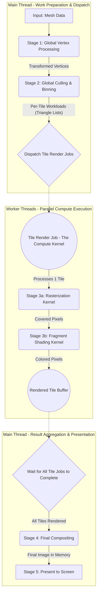
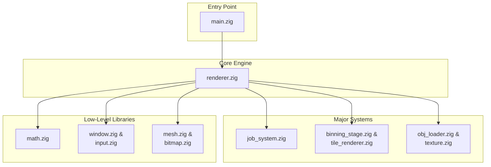

# Technical Overview of the Zig 3D CPU Rasterizer

This document provides a detailed technical overview of the Zig 3D CPU Rasterizer project, outlining its core architectural principles, rendering pipeline, key modules, and future development directions. The project aims to build a high-performance, multi-threaded 3D renderer entirely on the CPU, offering fine-grained control over every aspect of the rendering process.

## Core Architectural Principles

The renderer is built upon several key architectural decisions designed to maximize performance and flexibility on modern multi-core CPUs:

*   **CPU-Based Rendering**: The entire rendering pipeline is implemented on the CPU, providing complete control over algorithms, memory access patterns, and parallelization strategies, without reliance on GPU hardware. This approach is ideal for learning and experimenting with rendering fundamentals.
*   **Multi-threading with a Work-Stealing Job System**: To leverage multi-core processors, the renderer employs a custom-built, work-stealing job system (`src/job_system.zig`). This system efficiently distributes rendering tasks (primarily tile rendering jobs) across all available CPU cores, ensuring high CPU utilization and parallel execution.
*   **Tile-Based Rendering**: The screen is divided into a grid of small, fixed-size "tiles." Rendering is performed on a per-tile basis, allowing for:
    *   **Parallel Execution**: Multiple tiles can be rendered simultaneously by different worker threads.
    *   **Improved Cache Locality**: The data for a single tile (pixels, depth, and relevant triangles) is small enough to fit into the CPU's fast L1/L2 caches, significantly reducing memory access latency.
*   **Data-Oriented Design (DOD)**: The project strives for a data-oriented approach, organizing data in memory to optimize for CPU cache performance. This involves using flat arrays for components (vertices, positions, etc.) to enable efficient, contiguous memory access during processing loops.
*   **CPU-Based Compute/Mesh Shader Paradigm**: The entire rendering process is viewed as a large compute job. The `JobSystem` acts as a compute dispatcher, and `TileRenderJob`s function as compute kernels or "meshlet-like shaders" that process screen-space chunks of geometry. This embraces the CPU's general-purpose nature for flexible, parallel data transformation.
*   **Data-Driven Configuration**: Application settings and level layouts are defined in external JSON files (`resources/configs/default.settings.json`, `resources/default.level.json`), allowing for easy modification and iteration without recompiling the application.
*   **Native Behavior System (Hybrid ECS)**: Entity behaviors are implemented as native Zig structs, loaded and configured via the `resources/default.level.json` file. This provides the performance of native code with the flexibility of a component-based system, avoiding the overhead and complexity of external scripting languages or Wasm runtimes.

## The Rendering Pipeline

The renderer processes 3D scenes through a sophisticated, multi-stage pipeline designed for performance and parallelism. This pipeline is detailed in `PIPELINE.md`, but a high-level overview is provided below.

## Project Architecture

The project is designed with a modular architecture, where `renderer.zig` acts as the central orchestrator, coordinating various specialized modules.

### Key Modules and Their Responsibilities:

*   **`main.zig`**: The application's entry point. Initializes the window, renderer, and job system, and manages the main event loop.
*   **`renderer.zig`**: The central orchestrator of the rendering process. It manages the rendering pipeline, handles user input, updates application state, and coordinates other rendering-related modules.
*   **`job_system.zig`**: Implements the custom work-stealing job system for parallel execution of tasks across CPU cores.
*   **`tile_renderer.zig`**: Contains the core logic for tile-based rendering, including `Tile`, `TileBuffer`, `TileGrid` data structures, and the `rasterizeTriangleToTile` function.
*   **`binning_stage.zig`**: Implements the triangle binning logic, assigning triangles to the screen tiles they overlap.
*   **`math.zig`**: Provides fundamental 3D math utilities: vector types (`Vec2`, `Vec3`, `Vec4`) and 4x4 matrix types (`Mat4`) for transformations.
*   **`obj_loader.zig`**: Handles parsing of Wavefront `.obj` 3D model files, including the crucial "de-indexing" process.
*   **`mesh.zig`**: Defines the `Mesh` data structure, representing 3D geometry with vertices, triangles, normals, and texture coordinates.
*   **`texture.zig`**: Manages texture data, including loading `.bmp` image files and sampling pixel colors using UV coordinates.
*   **`bitmap.zig`**: Handles low-level bitmap creation and pixel buffer management, interfacing with the Windows GDI.
*   **`lighting.zig`**: Implements basic flat shading calculations, including ambient and diffuse light components.
*   **`window.zig`**: Abstracts platform-specific window creation and management using the Windows API.
*   **`input.zig`**: Manages keyboard and mouse input state, translating raw OS events into actionable input.
*   **`app_config.zig`**: (Will be refactored) Currently holds global constants; will be updated to load settings from `resources/configs/default.settings.json`.

## Data-Driven Configuration

The project utilizes external JSON files for flexible configuration and level design:

*   **`resources/configs/default.settings.json`**: Defines application-level settings such as window dimensions, rendering resolution scale, FPS limits, V-sync, threading parameters, and debug flags.
*   **`resources/default.level.json`**: Describes the layout of a 3D scene, including camera properties, light sources, and a hierarchical list of entities. Each entity can specify its model, material (with multiple texture maps), transform (position, rotation, scale), and attached native behaviors (scripts).

## Future Directions and Challenges

The `TODO.md` file outlines a comprehensive list of future enhancements and identified issues. Key areas for future development include:

*   **Performance Optimizations**: Extensive use of SIMD instructions (AVX, AVX2, AVX512) for math, vertex processing, rasterization, and pixel shading. Algorithmic improvements like vertex deduplication and caching transformation matrices.
*   **Architectural Shift to Mesh Shaders**: A significant refactoring effort to convert the tile-based system into a mesh shader-like pipeline, introducing meshlets as the primary unit of parallel work.
*   **Bug Fixes**: Addressing critical issues such as the lack of depth testing in the tiled renderer, window resizing support, and inefficiencies in the OBJ loader.
*   **Rendering Features**: Implementing advanced shading models (Gouraud, Phong), multiple light sources, advanced texture filtering (bilinear, trilinear, mipmapping), and transparent objects.
*   **Cross-Platform Support**: Abstracting platform-specific code to enable compilation and execution on Linux and macOS.

This technical overview provides a foundation for understanding the current state and future potential of the Zig 3D CPU Rasterizer.
