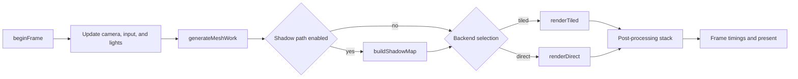

# Rendering Pipeline

This document describes the current frame flow in the renderer. It is intentionally higher level than `src/renderer.zig`, but it uses the current function names and current pass ordering instead of the older tutorial-style explanation.

## Overview

The frame is organized around a CPU-first pipeline:

- update camera and light state
- build or reuse cached frame-view data
- generate mesh work from the active mesh
- optionally build shadow data
- render through the tiled or direct backend
- run enabled post-processing passes
- record timings and present the backbuffer

## High-Level Flow

## Frame Stages

### 1. Frame Setup

The frame starts in `Renderer.render3DMeshWithPump`.

This stage handles:

- input-driven camera movement
- mouse look and FOV updates
- per-light orbit and direction updates
- cached frame-view recomputation only when state changed
- optional profiling capture start and stop

### 2. Mesh Work Generation

`generateMeshWork` prepares the geometry that the raster stage will consume.

This stage is where the renderer now does most of the geometry-side work:

- visibility and culling decisions
- meshlet-oriented task preparation
- transformed vertex reuse and frame-local scratch usage
- primitive emission for the active render backend

This is the current center of the frame’s geometry cost. Older descriptions that implied a simple one-pass global vertex transform are incomplete now.

### 3. Shadow Preparation

If the configured shadow path is enabled, the renderer runs shadow setup before the main shading path.

Depending on configuration, that can include:

- shadow map generation through `buildShadowMap`
- hybrid or meshlet-shadow preparation
- shadow-system acceleration reuse and update logic

The exact combination is controlled by `assets/configs/default.settings.json` and the runtime flags loaded from it.

### 4. Main Raster Path

The renderer can currently shade through two primary backends:

- `renderTiled`: the main tile-based renderer used for most of the CPU raster work
- `renderDirect`: a simpler path that bypasses some tile scheduling

The tiled path is the more feature-rich and performance-oriented one. It relies on worker jobs, per-tile buffers, and later composition into the main bitmap.

### 5. Post-Processing Stack

After the main scene pass, the renderer conditionally runs a stack of full-screen or screen-space effects.

The current stack can include:

- skybox resolve
- adaptive or hybrid shadow resolve
- SSR
- depth fog
- TAA
- motion blur
- god rays
- bloom
- lens flare
- depth of field
- chromatic aberration
- film grain and vignette
- color correction and grading

Not every pass runs every frame. The config file decides which ones are active.

### 6. Profiling And Present

At the end of the frame, the renderer can:

- record exact per-pass timings
- emit the `frame_profile` log lines
- save a Chrome trace-compatible `profile.json` capture
- present the completed backbuffer to the Win32 window

## Notes For Code Changes

When changing the pipeline, keep these constraints in mind:

- the frame mixes stable code and experiments, so not every pass is equally mature
- pass cost is already tracked, so use timing output before rearranging work
- shadow and post-processing toggles significantly change the effective pipeline
- meshlet work generation and tile population are now more important than the older docs suggested