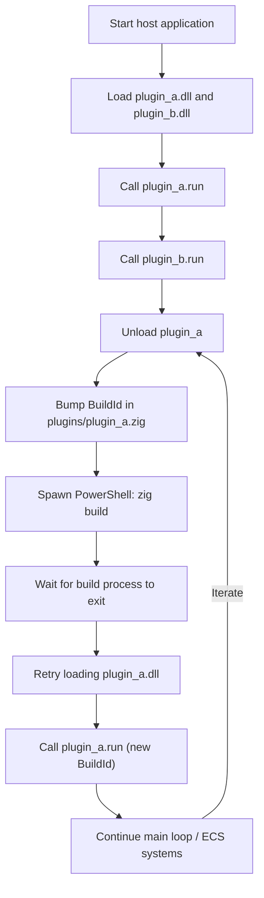

# Hot Reloading Experiment

This experiment demonstrates automated hot-reloading of dynamically linked modules inside a Zig application. The host edits plugin source, launches a Powershell-driven `zig build`, waits for the compile to finish, and then reloads the fresh DLL—all while the process stays alive.

## Overview

The experiment consists of three moving pieces:

1.  **Host Application (`zig-out/bin/hotreload_demo.exe`):** Loads plugins, owns the hot-reload loop, and issues rebuild commands.
2.  **Plugins (`zig-out/bin/plugin_a.dll`, `plugin_b.dll`):** DLLs that expose a `plugin_entry` function returning an API struct with `run`/`shutdown` callbacks.
3.  **Plugin Interface (`plugin_interface.zig`):** Shared ABI contract; all callbacks use `.c` calling convention and operate on raw pointer/length pairs for Windows-friendly interoperability.

## Hot Reloading Process

The hot-reloading process is demonstrated with `plugin_a`. The host application performs the following steps:

1.  **Initial load:** The host loads both plugins and executes their `run` functions.
2.  **Self-edit:** Before unloading plugin A, the host edits `plugins/plugin_a.zig` in-place, bumping the `BuildId` constant so the recompiled DLL prints a new banner.
3.  **Rebuild:** The host spawns `powershell -NoProfile -Command "zig build"`. When the Powershell process exits, we know `zig build` (and DLL copying) finished.
4.  **Reload:** The host retries `std.DynLib.open` until the new DLL unlocks, then re-invokes the plugin’s `run` function to show the updated `BuildId`.

The same pattern applies to any plugin: dump state, unload, rebuild, reload, and resume without restarting the host.

### Flow Diagram



## ECS Vision

The long-term plan is to back our in-house Entity Component System with this hot-reload stack. Systems would live in plugins that export ECS-facing APIs. During development the host would:

- unload a system module,
- rebuild it via `zig build`,
- hotplug the refreshed DLL,
- migrate or rehydrate ECS state if needed,
- and continue the simulation without losing entity data.

Keeping everything in Zig means we avoid FFI overhead, manage component layouts directly, and script gameplay changes in the same language as the engine. Rapid iteration—changing a system, hitting build, and immediately seeing the result in the running ECS world—is the core motivation for this experiment.

## Building and Running

To build and run the experiment, follow these steps:

1.  **Build the host and plugins:**

    ```sh
    zig build
    ```

2.  **Run the host application:**

    ```sh
    ./zig-out/bin/hotreload_demo ./zig-out/bin/plugin_a.dll ./zig-out/bin/plugin_b.dll
    ```

You will see the plugins run twice; the second pass shows the new `BuildId`, confirming the DLL was rebuilt and reloaded while the host stayed alive.